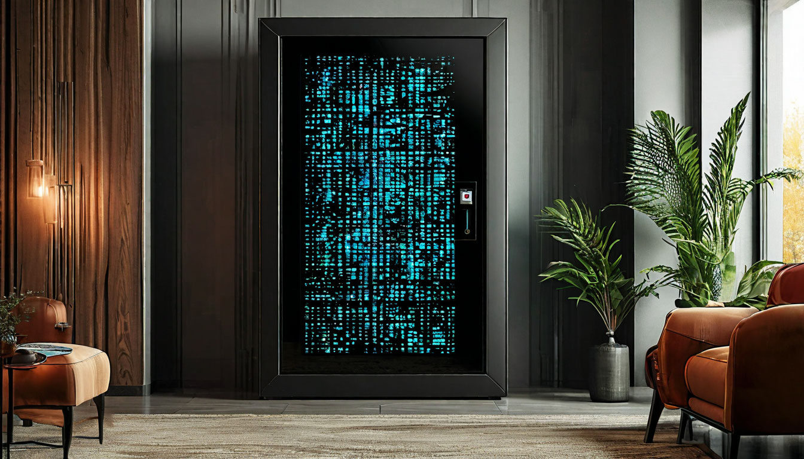

  

# Docs Vault

## About The Project
:star: Storage for all that document numbers, codes, passwords that you need from time to time.

## Components

### Frontend
- **docs-vault-app** - Main frontend application for users of Docs Vault.
- **admin-app** - Thymeleaf-based frontend app for resources administration.

### Backend
- **account-service** - Service for user (and admin) accounts information. Stores user data, credentials etc.
- **vault-service** - Service that responsible for store data, relationships between doc types and hashes. Contains REST-controllers for CRUD operations over quizzes.
- **i18n-service** - Service for internalization. Stores translations into different languages.
- **media-service** - Service, designed for working with media files for exercises, such as video previews and instructions. Stores media files with S3 object storage.
